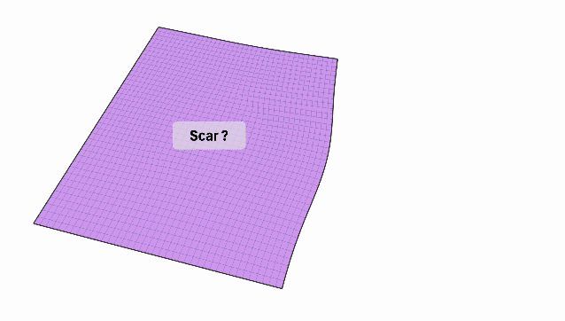

# Reconstruction of the local contractility of the cardiac muscle from deficient apparent kinematics

Giulia Pozzi, Davide Ambrosi, Simone Pezzuto



arxiv: [https://arxiv.org/abs/2404.11137](https://arxiv.org/abs/2404.11137)

Try on colab! [](https://colab.research.google.com/drive/1KePQ0ncEYbPp7jXSdAUW22pDyt5qIN-5?usp=sharing)

This repository contains a demo implementation the paper [_Reconstruction of the local contractility of the cardiac muscle from deficient apparent kinematics_](#citation).

The code solves an inverse problem for delineating a non-contractile region from displacement data and assuming an hyperelastic constitutive law.

## Installation

The code is based on [firedrake](https://www.firedrakeproject.org). The examples are provided in a Jupyter notebook.

To install firedrake, follow the instruction here: [https://www.firedrakeproject.org/download.html](https://www.firedrakeproject.org/download.html)

An additional requirements is `pyvista` (for 3d plotting)

```bash
pip install pyvista
```

**Note**: This version of the code does not rely on `pyadjoint`.

## Citation

```bibtex
@article{InvScar,
    title = {Reconstruction of the local contractility of the cardiac muscle
             from deficient apparent kinematics},
    author = {Pozzi, Giulia and Ambrosi, Davide and Pezzuto, Simone},
    eprinttype = {arxiv},
    eprint = {2404.11137}
}
```
